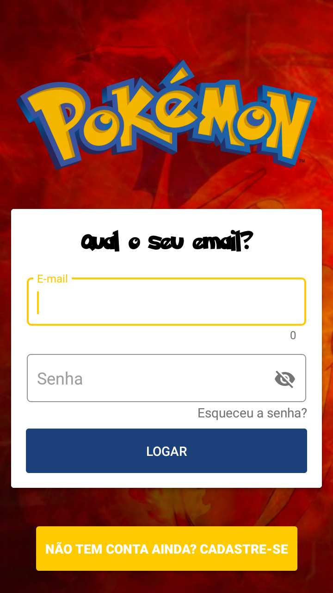
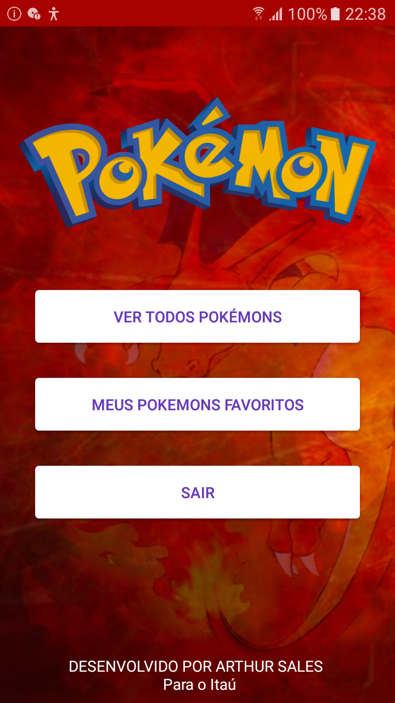
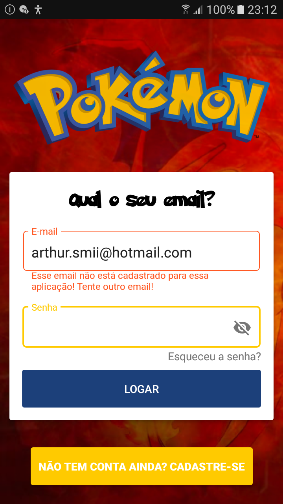
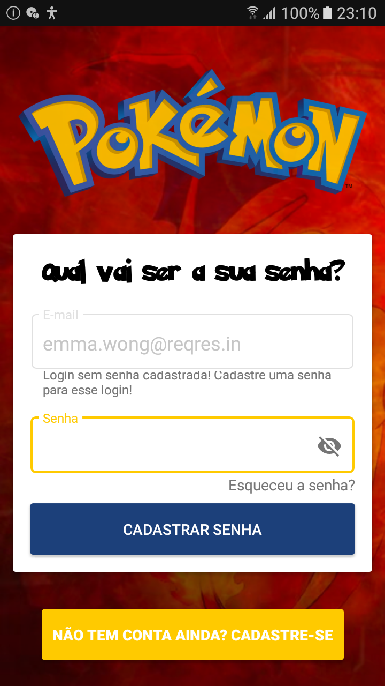
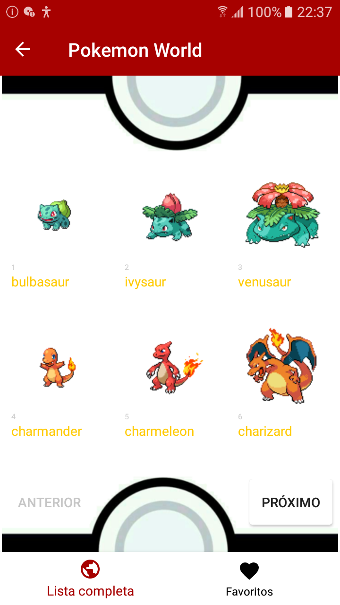
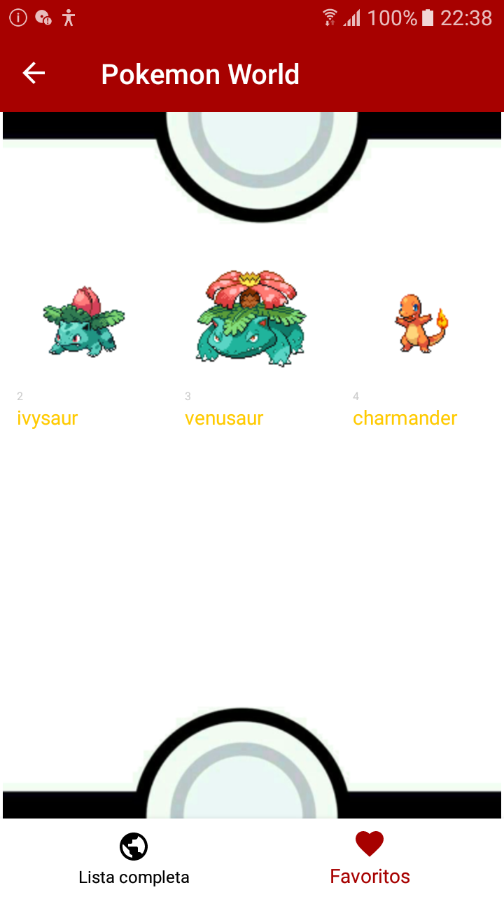

# PokemonWorld
Trabalhando com a API de Pokemon, usando MVVM, Retrofit e androidX.

## Nossa Missão

App desenvolvido para visualizar os nossos amados pokémons. 

## Nossa Proposta

O app possui uma tela de login focada no atendimento dos usuários da reqres.in,
que poderam cadastrar uma senha para o seu email já existente e assim poder visualizar todos os Pokemon e selecionar seus favoritos. 

## Como funciona
O usuário baixa o aplicativo, tenta logar com seu e-mail, se o mesmo já estiver cadastrado é verificado se existe uma senha associada aquele email, caso não exista ele será direcionado para o cadastro da mesma, uma vez cadastrada ele terá acesso ao app.
Dentro do aplicativo será exibido uma lista de pokemons dos quais o usuário poderá selecionar os seus favoritos, que ficaram visiveis mesmo offline (no caso do usuário permanecer logado após utilizar o app.)

## Características Técnicas

Aplicativo desenvolvido em Kotlin, utilizando androidX,SQLite banco de dados do android que permite salvar dados no próprio device,
Koin para injeção de dependência, Retrofit para o webservice, Gson para parse do json, Stetho para debug das requests, Picasso para tratamento de imagem, RecyclerView para tratamento de listas, AAC(Android Architecture Components) para o uso de LiveData necessárias na arquitetura MVVM, por fim o Material Design do Google para uso de BottomBar,Toolbar e outros apetrechos para design.  

###### Kotlin; SQLite; MVVM; Retrofit; Koin;

## Instruções para uso

As instruções abaixo permitirão baixar uma cópia do projeto, para ser executada em sua estação, para validação das funcionalidades.

### Pré-requisitos

Clone este repositório em sua estação:

```
git clone https://github.com/arthurproducer/PokemonWorld/tree/login/with/SampleAPI
```

Accesse o directório do projeto:

```
cd pokemonworld
```

## Detalhando as telas
|   |  |  |
|:---:|:---:|:---:|
| Splash | Login | Menu Principal |

### Splash
A tela Splash é a mais simples das telas, sua função é direcionar o usuário que já está logado direto para a tela principal ou envia-lo para a tela de Login caso não esteja logado.

### Main
Direciona o usuário para as demais telas do app e serve para que o mesmo possa voltar a tela de Login. Ganhara novas funcionalidades nas próximas versões.

### Login
|   |  |  |
|:---:|:---:|:---:|
| Login | LoginInvalido | Cadastro de Senha |

A tela de Login possibilita o acesso as demais funcionalidades do aplicativo. Para que o usuário possa se autenticar é necessário que seu e-mail esteja dentre os cadastrados na API da reqres.in, se estiver, será valido se existe alguma senha vinculada ao usuário no device, se não tiver o mesmo deve cadastra-la na tela de Cadastro de Senha. Uma vez com o Login e senha o acesso ao aplicativo é livre.
###### OBS: o botão não tem conta ainda? Cadastre-se faz parte de uma melhoria integrada ao Firebase. Saiba mais ao final do READ.ME na parte de trabalhos futuros.

### Listas de Pokemon
|   |  |  |
|:---:|:---:|:---:|
| Lista de Pokemon | Favoritos | Detalhes do Personagem |
|Lista completa de todos os Pokemons, sendo exibido de 100 em 100.|Tela onde temos os pokemons favoritos de cada usuario.É possível visualizar esses pokemon mesmo offline.|Na Tela de detalhes temos diversas informações do Pokemon, vindas da  API.|

### Melhorias Mapeadas
O Login passara ser intregrado com Firebase.
Tudo que foi feito com SQLite recebera um upgrade com ROOM.

## Version

1.0.0


## Authors
* **Arthur Sales** - [arthurproducer](https://github.com/arthurproducer)
